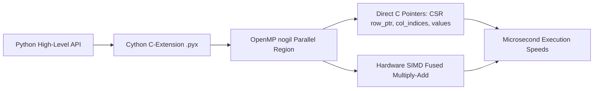

# CYTHON-SCIENTIFIC-COMPUTING 
# High-Performance Scientific Computing Engine (Cython)

## Executive Overview
A C-accelerated scientific computing engine written in **Cython**. It implements high-performance **Compressed Sparse Row (CSR)** Sparse Matrix-Vector Multiplication (SpMV) and 4th-order **Runge-Kutta (RK4)** numerical integration for non-linear chaotic dynamical systems (Lorenz Attractors) with zero Python GIL overhead.

## Computation Architecture



### Source Tree
- **`src/sparse_solver.pyx`**: Pure Cython source with C-type annotations (`cdef`, `nogil`, direct buffer access).
- **`setup.py` & `pyproject.toml`**: Native C-extension build configuration.
- **`runner/run.py`**: Benchmark runner evaluating numerical accuracy and timing.

## Mathematical Formulation: Compressed Sparse Row (CSR) SpMV
For sparse matrix A in CSR format with arrays `values`, `col_indices`, and `row_ptr`:
$$y_i = \sum_{j = \text{row\_ptr}[i]}^{\text{row\_ptr}[i+1] - 1} \text{values}[j] \cdot x[\text{col\_indices}[j]]$$

## Native Cython Compilation & Benchmark
```bash
python setup.py build_ext --inplace
python runner/run.py
```

## Universal Verification
```bash
python runner/run.py
# Or via master orchestrator
node orchestrator/run.js --project=16-cython
```

## Senior Interview Q&A
- **Q: How does Cython achieve near-C speeds?** By releasing the Python GIL (`with nogil:`), disabling array bounds checking (`@cython.boundscheck(False)`), and eliminating Python object boxing through typed memoryviews (`double[:]`).
- **Q: Why use CSR format?** In physical simulations, stiffness matrices are over 99% sparse. Storing only non-zero elements reduces memory consumption from $O(N^2)$ to $O(N + \text{NNZ})$ and optimises CPU L1/L2 cache locality.\n
